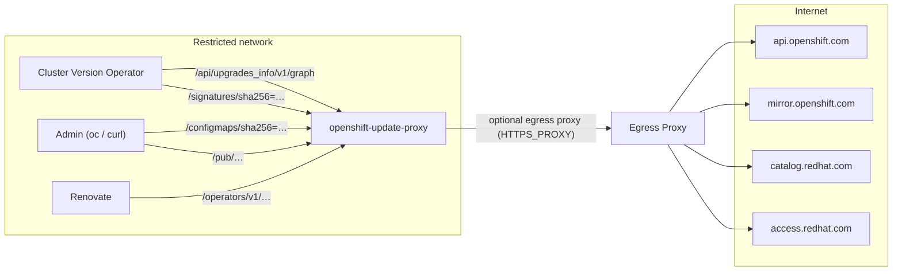

# 🔄 openshift-update-proxy

[](https://github.com/slauger/openshift-update-proxy/actions/workflows/ci.yml)
[](https://github.com/slauger/openshift-update-proxy/actions/workflows/release.yml)
[](https://pypi.org/project/openshift-update-proxy/)
[](LICENSE)

A small Flask based service which forwards HTTP requests to `api.openshift.com`,
`mirror.openshift.com`, `catalog.redhat.com` and `access.redhat.com`. Built for
restricted networks where OpenShift clusters have no direct internet access, but a
central egress proxy (or a single host with internet access) exists.

## Features

- 🔀 **Update Graph Proxy** - forwards Cincinnati update graph requests
  (`/api/upgrades_info/v1/graph`) to `api.openshift.com`
- 📦 **Mirror Proxy** - forwards requests for clients and release artifacts to
  `mirror.openshift.com/pub`
- 🔏 **Signature Store** - serves release image signatures for
  `ClusterVersion.spec.signatureStores` (OpenShift 4.14+)
- 🗺️ **ConfigMap Generator** - renders ready-to-apply signature ConfigMaps for the
  classic disconnected verification workflow
- 🎛️ **Operator Catalog API** - serves operator channels and versions from the
  Red Hat Pyxis API (`catalog.redhat.com`), ready to use as a
  [Renovate custom datasource](https://docs.renovatebot.com/modules/datasource/custom/)
- 📅 **Supported Versions API** - combines the Red Hat product lifecycle API with the
  update graph to list supported OpenShift minor versions and their latest release
- 🚦 **Egress Proxy Aware** - honors `HTTPS_PROXY` / `NO_PROXY` for all upstream requests
- 🐳 **Hardened Container** - UBI9 based, rootless (UID 1001), digest-pinned base image,
  Cosign signed
- ⛵ **Helm Chart** - deploy to Kubernetes/OpenShift with probes and sane security defaults
- 🩺 **Health Endpoint** - `/healthz` for liveness and readiness probes

## How it works



## Endpoints

| Endpoint | Upstream | Purpose |
|----------|----------|---------|
| `/api/<path>` | `https://api.openshift.com/api/` | Cincinnati update graph (`/api/upgrades_info/v1/graph`) |
| `/pub/<path>` | `https://mirror.openshift.com/pub/` | OpenShift mirror (clients, release artifacts) |
| `/signatures/<path>` | `https://mirror.openshift.com/pub/openshift-v4/signatures/openshift/release/` | Release image signature store |
| `/configmaps/<version or sha256=digest>` | derived from signature store | Ready-to-apply signature ConfigMap (YAML) |
| `/catalog/<path>` | `https://catalog.redhat.com/api/containers/v1/` | Red Hat Pyxis API (operator catalog metadata) |
| `/operators/v1/<catalog>/<package>/channels` | derived from Pyxis | Channels, default channel and latest CSV per channel |
| `/operators/v1/<catalog>/<package>/<channel>/releases` | derived from Pyxis | Version feed in Renovate custom datasource format |
| `/lifecycle/<path>` | `https://access.redhat.com/product-life-cycles/api/v1/` | Red Hat product lifecycle API |
| `/versions/v1/supported` | derived from lifecycle API + update graph | Supported OpenShift minors with latest release per channel |
| `/healthz` | - | Health check for liveness/readiness probes |

## Configuration

All configuration is done via environment variables:

| Variable | Default | Description |
|----------|---------|-------------|
| `HTTPS_PROXY` | - | Egress proxy for upstream requests (standard `requests` behaviour, `NO_PROXY` is honored) |
| `INSECURE_SKIP_TLS_VERIFY` | `false` | Skip TLS certificate verification for upstream requests (`true`/`1`/`yes`) |
| `API_UPSTREAM` | `https://api.openshift.com/api/` | Cincinnati API base URL |
| `MIRROR_UPSTREAM` | `https://mirror.openshift.com/pub/` | Mirror base URL |
| `SIGNATURE_UPSTREAM` | `https://mirror.openshift.com/pub/openshift-v4/signatures/openshift/release/` | Signature store base URL |
| `CATALOG_UPSTREAM` | `https://catalog.redhat.com/api/containers/v1/` | Red Hat Pyxis API base URL |
| `CATALOG_CACHE_TTL` | `600` | Cache TTL in seconds for operator catalog lookups (`0` disables caching) |
| `LIFECYCLE_UPSTREAM` | `https://access.redhat.com/product-life-cycles/api/v1/` | Red Hat product lifecycle API base URL |
| `LIFECYCLE_CACHE_TTL` | `3600` | Cache TTL in seconds for lifecycle and latest-release lookups (`0` disables caching) |
| `REQUEST_TIMEOUT` | `30` | Upstream request timeout in seconds |
| `LISTEN_HOST` | `0.0.0.0` | Listen address |
| `LISTEN_PORT` | `5000` | Listen port |

## Quick Start

### Container

```bash
docker run --rm -p 5000:5000 \
  -e HTTPS_PROXY=http://proxy.example.com:3128 \
  ghcr.io/slauger/openshift-update-proxy:latest
```

The image is based on `registry.access.redhat.com/ubi9/python-314`, runs as UID `1001`
and is built from the `Containerfile` in this repository.

### Helm

The chart is published as an OCI artifact to ghcr.io on every release:

```bash
helm install update-proxy oci://ghcr.io/slauger/charts/openshift-update-proxy \
  --set env[0].name=HTTPS_PROXY,env[0].value=http://proxy.example.com:3128
```

Or from a git checkout: `helm install update-proxy ./chart`

### PyPI

```bash
python3 -m venv .venv && source .venv/bin/activate
pip install openshift-update-proxy
openshift-update-proxy
```

## Cluster integration

### Update graph

Point the ClusterVersion `upstream` at the proxy:

```yaml
apiVersion: config.openshift.io/v1
kind: ClusterVersion
metadata:
  name: version
spec:
  upstream: http://update-proxy.example.com:5000/api/upgrades_info/v1/graph
```

### Release signatures

For updates by digest (`oc adm upgrade --to-image ...@sha256:...`) the CVO must verify the
release image signature.

The `/configmaps/` endpoint fetches all signatures for a release and renders a
ready-to-apply ConfigMap (same format as `oc adm release mirror` / oc-mirror produces).
It accepts a release version directly - the digest is resolved via the update graph:

```bash
curl -s "http://update-proxy.example.com:5000/configmaps/4.16.8" | oc apply -f -
```

The optional `arch` (default `amd64`) and `channel_prefix` (default `stable`) query
parameters select the architecture and the update channel used for the lookup, e.g.
`/configmaps/4.16.8?arch=arm64`.

Alternatively, a release digest can be passed directly:

```bash
DIGEST=$(oc adm release info quay.io/openshift-release-dev/ocp-release:4.16.8-x86_64 -o jsonpath='{.digest}')
curl -s "http://update-proxy.example.com:5000/configmaps/${DIGEST/:/=}" | oc apply -f -
```

The ConfigMap is created in `openshift-config-managed` with the
`release.openshift.io/verification-signatures` label, where the CVO picks it up.

> **Note:** The ClusterVersion API also has a `spec.signatureStores` field, but it is
> gated behind the TechPreview-only `SignatureStores` feature gate and will not be
> promoted to GA ([OTA-1118](https://issues.redhat.com/browse/OTA-1118)). The ConfigMap
> above is the supported way to provide signatures.

## Operator catalog and Renovate

The `/operators/v1/` endpoints answer "which operator versions exist in which
channel?" without pulling the multi-hundred-MB catalog index images and without any
registry credentials. The data comes from the public
[Red Hat Pyxis API](https://catalog.redhat.com/api/containers/docs/) and covers all
four default catalogs: `redhat-operators`, `certified-operators`,
`community-operators` and `redhat-marketplace`.

List channels, default channel and the latest CSV per channel:

```bash
curl -s "http://update-proxy.example.com:5000/operators/v1/redhat-operators/openshift-gitops-operator/channels?ocp_version=4.16"
```

```json
{
  "package": "openshift-gitops-operator",
  "organization": "redhat-operators",
  "default_channel": "latest",
  "channels": [
    {"name": "gitops-1.21", "latest_version": "1.21.4", "latest_csv": "openshift-gitops-operator.v1.21.4"}
  ]
}
```

List all versions of a channel in the format Renovate expects from a
[custom datasource](https://docs.renovatebot.com/modules/datasource/custom/):

```bash
curl -s "http://update-proxy.example.com:5000/operators/v1/redhat-operators/openshift-gitops-operator/gitops-1.21/releases?ocp_version=4.16"
```

```json
{
  "releases": [
    {"version": "1.21.3", "releaseTimestamp": "2026-08-14T23:45:28.177000+00:00"},
    {"version": "1.21.4", "releaseTimestamp": "2026-09-03T12:13:37.391000+00:00"}
  ]
}
```

The optional `ocp_version` query parameter limits results to bundles shipped in the
catalog for that OpenShift minor version. Responses are cached in memory for
`CATALOG_CACHE_TTL` seconds. The raw Pyxis API is available under `/catalog/`, e.g.
`/catalog/operators/indices?filter=organization==redhat-operators` lists all index
image tags with their end-of-life dates.

With this feed, Renovate can bump pinned operator versions (`startingCSV` in OLM
`Subscription` manifests, whether managed directly via Argo CD or embedded in ACM
policies) just like any other dependency - merging the PR rolls out the operator
update. See [examples/renovate/](examples/renovate/) for a complete working setup:
a `renovate.json` with the custom datasource and regex manager, plus matching
Subscription and ACM Policy manifests.

## Supported OpenShift versions

`/versions/v1/supported` combines the
[Red Hat product lifecycle API](https://access.redhat.com/product-life-cycles) with
the Cincinnati update graph: all OpenShift minor versions that are not end-of-life,
together with the latest release in the corresponding update channel.

```bash
curl -s "http://update-proxy.example.com:5000/versions/v1/supported"
```

```json
{
  "product": "OpenShift Container Platform",
  "architecture": "amd64",
  "versions": [
    {"version": "4.22", "support_phase": "Full Support", "channel": "stable-4.22", "latest_release": "4.22.11"},
    {"version": "4.20", "support_phase": "Maintenance Support", "channel": "stable-4.20", "latest_release": "4.20.35"}
  ]
}
```

The optional `channel_prefix` (default `stable`, e.g. `eus`, `fast`, `candidate`) and
`arch` (default `amd64`) query parameters select the channel and architecture;
`latest_release` is `null` when the channel has no published releases yet. The raw
lifecycle API is available under `/lifecycle/`, e.g.
`/lifecycle/products?name=OpenShift Container Platform`.

[examples/create-configmaps.sh](examples/create-configmaps.sh) combines this with
the `/configmaps/` endpoint: it fetches the release signatures for a set of update
channels through the proxy and applies them as ConfigMaps.

## Local Development

```bash
python3 -m venv .venv
source .venv/bin/activate
pip install -e ".[dev]"
openshift-update-proxy
```

Run tests and linting:

```bash
make test
make lint
```

Build the container image:

```bash
make build
```

## Supply Chain Security

- The UBI9 base image is pinned by digest and kept up to date by
  [Renovate](https://docs.renovatebot.com/); remaining CVEs are patched at build time via
  `dnf upgrade`.
- Python and GitHub Actions dependencies are also managed by Renovate (with automerge for
  non-major updates).
- Releases are fully automated with
  [python-semantic-release](https://python-semantic-release.readthedocs.io/) based on
  Conventional Commits and published to PyPI.
- Container images are signed with [Cosign](https://github.com/sigstore/cosign) (keyless,
  GitHub Actions OIDC). Verify with:

```bash
cosign verify \
  --certificate-identity-regexp 'https://github.com/slauger/openshift-update-proxy/.*' \
  --certificate-oidc-issuer https://token.actions.githubusercontent.com \
  ghcr.io/slauger/openshift-update-proxy:latest
```

## License

[Apache License 2.0](LICENSE)
