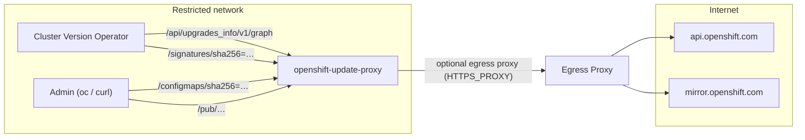

# 🔄 openshift-update-proxy

[](https://github.com/slauger/openshift-update-proxy/actions/workflows/ci.yml)
[](https://github.com/slauger/openshift-update-proxy/actions/workflows/release.yml)
[](https://pypi.org/project/openshift-update-proxy/)
[](LICENSE)

A small Flask based service which forwards HTTP requests to `api.openshift.com` and
`mirror.openshift.com`. Built for restricted networks where OpenShift clusters have no
direct internet access, but a central egress proxy (or a single host with internet
access) exists.

## Features

- 🔀 **Update Graph Proxy** - forwards Cincinnati update graph requests
  (`/api/upgrades_info/v1/graph`) to `api.openshift.com`
- 📦 **Mirror Proxy** - forwards requests for clients and release artifacts to
  `mirror.openshift.com/pub`
- 🔏 **Signature Store** - serves release image signatures for
  `ClusterVersion.spec.signatureStores` (OpenShift 4.14+)
- 🗺️ **ConfigMap Generator** - renders ready-to-apply signature ConfigMaps for the
  classic disconnected verification workflow
- 🚦 **Egress Proxy Aware** - honors `HTTPS_PROXY` / `NO_PROXY` for all upstream requests
- 🐳 **Hardened Container** - UBI9 based, rootless (UID 1001), digest-pinned base image,
  Cosign signed
- ⛵ **Helm Chart** - deploy to Kubernetes/OpenShift with probes and sane security defaults
- 🩺 **Health Endpoint** - `/healthz` for liveness and readiness probes

## How it works



## Endpoints

| Endpoint | Upstream | Purpose |
|----------|----------|---------|
| `/api/<path>` | `https://api.openshift.com/api/` | Cincinnati update graph (`/api/upgrades_info/v1/graph`) |
| `/pub/<path>` | `https://mirror.openshift.com/pub/` | OpenShift mirror (clients, release artifacts) |
| `/signatures/<path>` | `https://mirror.openshift.com/pub/openshift-v4/signatures/openshift/release/` | Release image signature store |
| `/configmaps/sha256=<digest>` | derived from signature store | Ready-to-apply signature ConfigMap (YAML) |
| `/healthz` | - | Health check for liveness/readiness probes |

## Configuration

All configuration is done via environment variables:

| Variable | Default | Description |
|----------|---------|-------------|
| `HTTPS_PROXY` | - | Egress proxy for upstream requests (standard `requests` behaviour, `NO_PROXY` is honored) |
| `INSECURE_SKIP_TLS_VERIFY` | `false` | Skip TLS certificate verification for upstream requests (`true`/`1`/`yes`) |
| `API_UPSTREAM` | `https://api.openshift.com/api/` | Cincinnati API base URL |
| `MIRROR_UPSTREAM` | `https://mirror.openshift.com/pub/` | Mirror base URL |
| `SIGNATURE_UPSTREAM` | `https://mirror.openshift.com/pub/openshift-v4/signatures/openshift/release/` | Signature store base URL |
| `REQUEST_TIMEOUT` | `30` | Upstream request timeout in seconds |
| `LISTEN_HOST` | `0.0.0.0` | Listen address |
| `LISTEN_PORT` | `5000` | Listen port |

## Quick Start

### Container

```bash
docker run --rm -p 5000:5000 \
  -e HTTPS_PROXY=http://proxy.example.com:3128 \
  ghcr.io/slauger/openshift-update-proxy:latest
```

The image is based on `registry.access.redhat.com/ubi9/python-314`, runs as UID `1001`
and is built from the `Containerfile` in this repository.

### Helm

The chart is published as an OCI artifact to ghcr.io on every release:

```bash
helm install update-proxy oci://ghcr.io/slauger/charts/openshift-update-proxy \
  --set env[0].name=HTTPS_PROXY,env[0].value=http://proxy.example.com:3128
```

Or from a git checkout: `helm install update-proxy ./chart`

### PyPI

```bash
python3 -m venv .venv && source .venv/bin/activate
pip install openshift-update-proxy
openshift-update-proxy
```

## Cluster integration

### Update graph

Point the ClusterVersion `upstream` at the proxy:

```yaml
apiVersion: config.openshift.io/v1
kind: ClusterVersion
metadata:
  name: version
spec:
  upstream: http://update-proxy.example.com:5000/api/upgrades_info/v1/graph
```

### Release signatures

For updates by digest (`oc adm upgrade --to-image ...@sha256:...`) the CVO must verify the
release image signature. There are two ways to get signatures into a restricted cluster:

**Option 1: Signature store (OpenShift 4.14+)**

Point the cluster at the `/signatures/` endpoint of the proxy:

```yaml
apiVersion: config.openshift.io/v1
kind: ClusterVersion
metadata:
  name: version
spec:
  signatureStores:
    - url: http://update-proxy.example.com:5000/signatures
```

**Option 2: Signature ConfigMap**

The `/configmaps/` endpoint fetches all signatures for a release digest and renders a
ready-to-apply ConfigMap (same format as `oc adm release mirror` / oc-mirror produces):

```bash
DIGEST=$(oc adm release info quay.io/openshift-release-dev/ocp-release:4.16.8-x86_64 -o jsonpath='{.digest}')
curl -s "http://update-proxy.example.com:5000/configmaps/${DIGEST/:/=}" | oc apply -f -
```

The ConfigMap is created in `openshift-config-managed` with the
`release.openshift.io/verification-signatures` label, where the CVO picks it up.

## Local Development

```bash
python3 -m venv .venv
source .venv/bin/activate
pip install -e ".[dev]"
openshift-update-proxy
```

Run tests and linting:

```bash
make test
make lint
```

Build the container image:

```bash
make build
```

## Supply Chain Security

- The UBI9 base image is pinned by digest and kept up to date by
  [Renovate](https://docs.renovatebot.com/); remaining CVEs are patched at build time via
  `dnf upgrade`.
- Python and GitHub Actions dependencies are also managed by Renovate (with automerge for
  non-major updates).
- Releases are fully automated with
  [python-semantic-release](https://python-semantic-release.readthedocs.io/) based on
  Conventional Commits and published to PyPI.
- Container images are signed with [Cosign](https://github.com/sigstore/cosign) (keyless,
  GitHub Actions OIDC). Verify with:

```bash
cosign verify \
  --certificate-identity-regexp 'https://github.com/slauger/openshift-update-proxy/.*' \
  --certificate-oidc-issuer https://token.actions.githubusercontent.com \
  ghcr.io/slauger/openshift-update-proxy:latest
```

## License

[Apache License 2.0](LICENSE)
